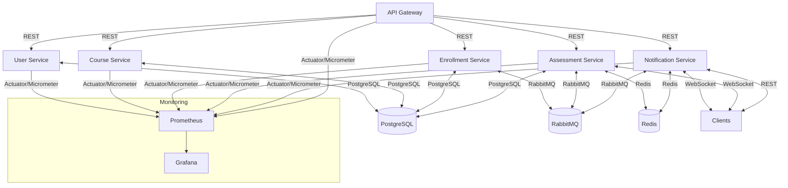

# LMS Microservices Architecture

## Overview
This document describes the architecture, data flows, and rationale for the AI-Powered Learning Management System (LMS).

## System Diagram

## Data Flows
- **User registration/authentication**: API Gateway → User Service → PostgreSQL
- **Course CRUD/search**: API Gateway → Course Service → PostgreSQL
- **Enrollment/progress**: API Gateway → Enrollment Service → PostgreSQL, RabbitMQ (for async events)
- **Assessment/quizzes**: API Gateway → Assessment Service → PostgreSQL, RabbitMQ, Redis (for live quiz)
- **Notifications/chat**: API Gateway → Notification Service → Redis (for chat/pubsub), WebSocket (for real-time)
- **Monitoring**: All services expose metrics to Prometheus, visualized in Grafana

## Technology Rationale
- **Spring Boot 3 + WebFlux**: Modern, reactive, scalable microservices
- **PostgreSQL**: Reliable, open-source relational database
- **Redis**: Fast in-memory store for real-time features and caching
- **RabbitMQ**: Robust message broker for async communication
- **Spring Cloud Gateway**: Centralized API gateway, routing, and resilience
- **Docker**: Containerization for portability and deployment
- **Prometheus + Grafana**: Monitoring and visualization
- **Resilience4j, Sleuth, Micrometer**: Fault tolerance, tracing, and metrics
- **Kubernetes (optional)**: For production orchestration 